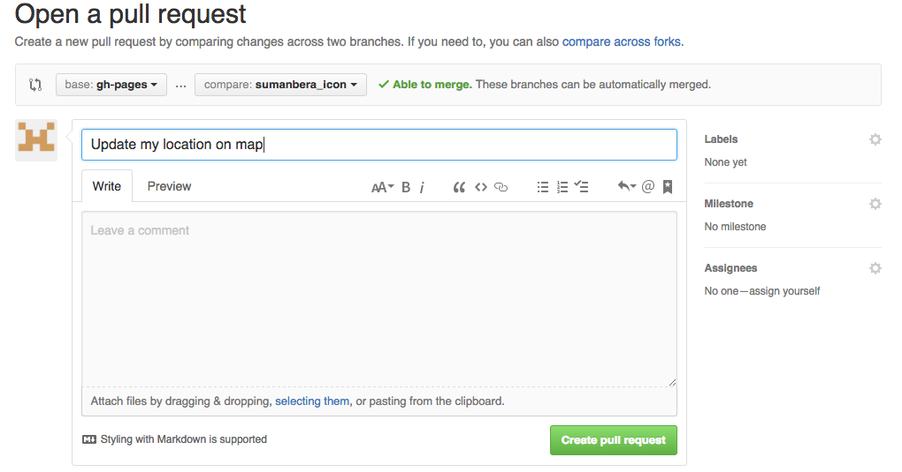
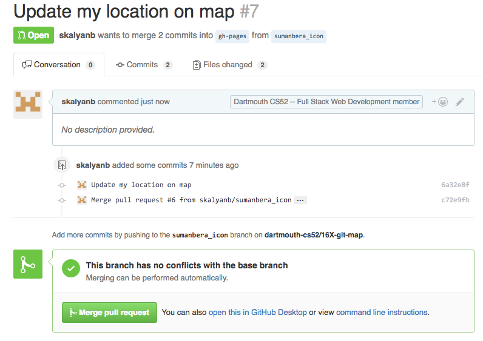
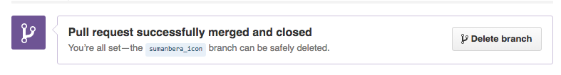
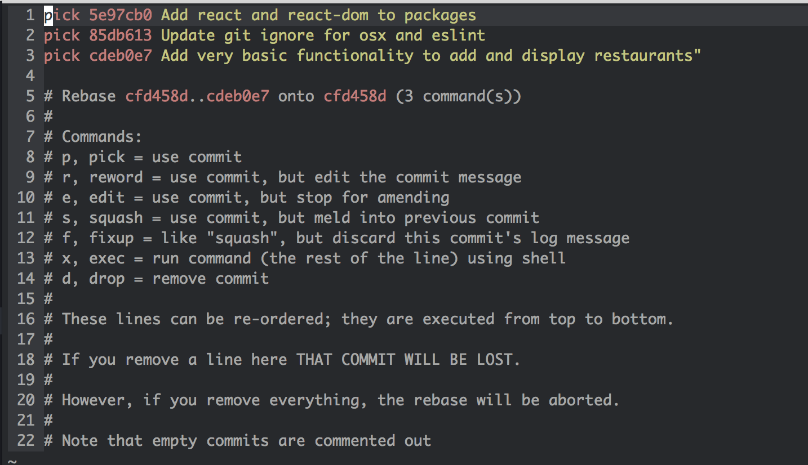
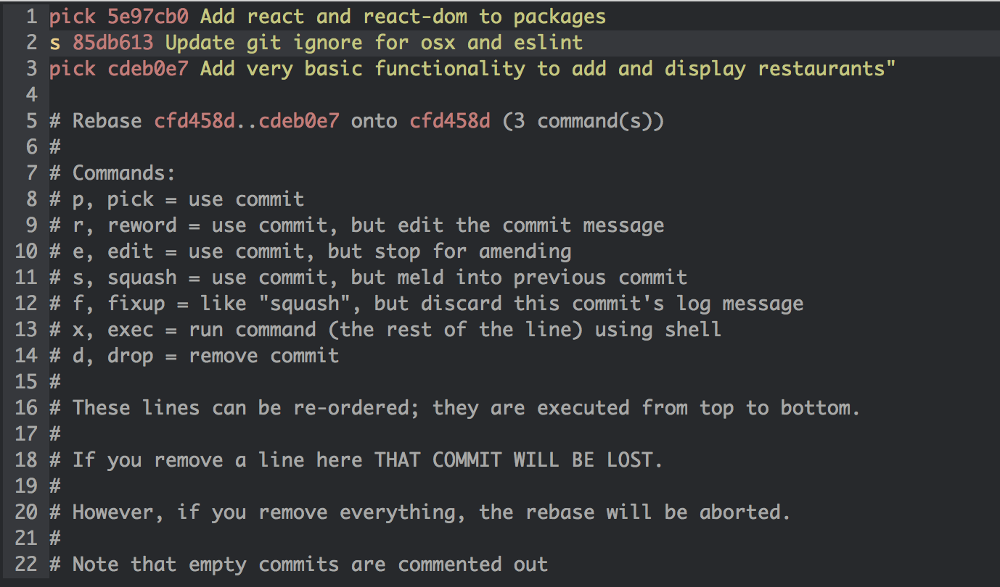
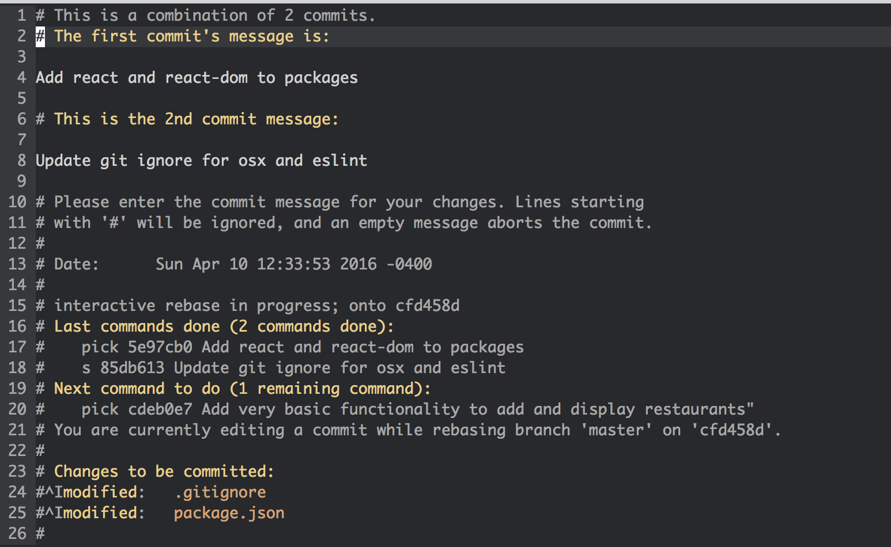

# CS52 Git Map Collaborative Coding


Now that you have a personal domain and page, let's work together on a map. The purpose here is to introduce you to Git Flow which we will be using from now on!

#### Key: <br />
🚀 steps to definitely pay attention to <br/>
💻 run this in Terminal<br />
🍸 pro tip<br />


## Steps At a Glance
Here's what we're going to do!

1. Clone The Repo
1. Start Local Webserver
1. Create a new branch
1. Merge Conflicts
1. Add some JS to Map
1. Rebase to pull new changes
1. Push branch to github
1. Create pull request


### Clone The Repo

1. 🚀 Clone the repo:
`git clone git@github.com:dartmouth-cs52-17S/git-map.git`
1. 🚀 change directory to this new workspace:
`cd git-map`

🐛 if you run into trouble with messages about ssh keys you need to configure your ssh keys  `ssh-keygen -t rsa -b 4096 -C "your_email@example.com"` (hit enter a bunch of times) and [upload that key to github](https://help.github.com/articles/connecting-to-github-with-ssh/).

### Start Local Webserver

```bash
💻 python -m SimpleHTTPServer 9000
Serving HTTP on 0.0.0.0 port 9000 ...
127.0.0.1 - - [09/Jun/2016 18:25:18] "GET / HTTP/1.1" 200 -
```
Lets check out what we have made in Chrome: http://localhost:9000


### Proper Git Flow

We're doing something a little different with git this time.  You are modifying a file that other people might be working on, thus the potential for a merge conflict arises.   The default flow for collaborating with others is:

1. `git commit` your local work
1. `git pull` to get any upstream commits (commits that exist on github but not on your computer yet)
1. resolve any conflicts that might have arisen
1. `git add` conflicted file to mark them as resolved
1. `git commit` your changes
1. `git push` your changes up to github

However!  We will be doing a slightly modified flow using feature branches.

It will go something like this:

1. `git branch` to create a new branch of code to work in
1. `git commit` your local work
1. `git pull --rebase` to merge any upstream main branch commits onto your branch
1. resolve any conflicts that might have arisen
1. `git add` conflicted files to mark them as resolved
1. `git commit` your changes
1. `git push` your branch up to github
1. create a pull request on github
1. get your pull request from your feature branch merged into the main branch


Here we go through a more in depth git flow that includes code branches and pull requests.  In general if your team is larger than 2 people you should definitely use this!

We're going to create a branch now and try out this new workflow.

### Create a new branch
Start a local feature branch and do work on it. A branch keeps your work separate from the main (usually called *master*) branch.  Think of this as a tree where the *master* (or in our case *gh-pages*) branch can be thought of as the trunk.

Here is a great visualization tool to help see what you are doing in the git tree: [git-with-d3](https://onlywei.github.io/explain-git-with-d3/#branch)

```bash
💻 git branch <feature>  # creates new branch feature
💻 git checkout <feature>  # switches to branch feature
```

🍸 Protip: `git checkout -b` will both create a new branch and check it out to make it the current branch you are working on.

🍸 Protip: `git branch` will show which branches exist and which you're on (the `*`).


🚀 lets name our branch feature with yourname_icon! `git checkout -b yourname_icon`.   (lowercase and no spaces)

🚀 if you do `git branch` you should see `* yourname_icon`.


🍸 Protip: Periodically pull in changes from *origin/gh-pages* (or *origin/master* in other situations) and update your feature branch.
Note that these commands only update your current local branch.  The idea here is to not fall too far behind the master branch if other people are working on it.

```bash
💻 git pull origin gh-pages
```

#### Merge Conflicts

At this point after a `git pull` you **may** get a message that looks like this:

```
CONFLICT (content): Merge conflict in somefile
Automatic merge failed; fix conflicts and then commit the result.
```

This is when the fun starts.  How do you fix this?

The cause for merge conflicts is that you edited the exact same line/s as someone else and git doesn't know how to automatically resolve that.  This happens and is normal, don't worry.  So to fix you just need to pick apart the conflict and merge it in — continue to the next section to see how this happens!

#### Deciphering Merge Conflicts

If you were to do this by hand, git takes the pretty code you wrote and injects terrible "conflict markers" that look like this:

```js
<<<<<< HEAD
var h = 'hello, world';
======
var h = 'Hi!';
>>>>>> cb1abc6bd98cfc84317f8aa95a7662815417802d
```

where the line between  `<<<HEAD` and `====` is the line/lines of code that are relevant in your file, and between  `====` and `>>>> cb1abc6` are from the remote repository (the repository that you see on github.com). The crazy characters refer to the commit that the change comes from.

Since we've been using Atom so far there is a nice plugin to help visualize this a little better. *Atom -> Preferences -> Install -> search* for merge-conflicts


Once you have your conflict file the way you want it — ie. fixed and without any more of the conflict markers...

- All you have to do to continue is:  `git add thefixedfile` which indicates to git that you have resolved the conflict. Then `git commit` with no options will complete the merge and automatically create a commit message.


### Map and Javascript

Now lets add a picture of yourself and a lat long for a place that you like or are from.

🚀 Open `people.json` in atom.

🚀 Add a new json object for yourself. You can start by copy pasting a previous object -- this is the 15 or so lines of text inside the curly braces.

Add an image of yourself into `iconURL`.   It would probably be a good idea to resize your image to be 200x200 pixels. If you don't have a favorite tool for this try [resizeimage](http://resizeimage.net/)

For the `url` field use the new page that you made earlier!  Rather than using http:// or https:// just start the url with //.  The browser will then match the protocol (http or https) to how the page was loaded and thus avoid errors about insecure resources.

Find a lat long: http://www.latlong.net/

🚀 Play around with it till you have a working badge visible on your local dev site:  http://localhost:9000/ and when click on the badge it is able to load in the page you made into the modal.


### Rebase local branch
When you're nearly ready to publish, rebase your local branch on top of the latest master one more time. Just like you have been above. Note: we are using rebasing here instead of just pulling, because now we are pros. 🏆  What this does is basically pull in all remote changes and then replay your commits on top of them. This gives you a cleaner version history.

```bash
💻 git pull --rebase origin gh-pages
```

If you have rebase conflicts, fix the files as in [Deciphering-Merge-Conflicts](#Deciphering-Merge-Conflicts) and do `git add`, then
 `git rebase --continue`. Repeat until you're all good.


### Push Your Feature Branch

After you are finished working on your branch, you should push it up to github.

```bash
💻 git push origin yourname_icon
```
🍸 Protip: git does not push multiple branches by default, but you can with: `git push --all origin`.  Just be careful if you have a ton of test branches lying around.


### Create Pull Request

The best way to merge your feature into the main branch is to issue a pull request. This bundles up your feature branch into a request that you or someone else on your team can approve.

🚀 Go to Github (or use the Github Desktop App) and submit a *New Pull Request* (choosing whatever branch you just pushed), add a quick description. Possibly do code review or just approve the request yourself. The idea here is that this is a checkpoint spot before adding your feature to the main branch so that everybody on your teams knows what is happening.



Ensure that you are comparing the correct two branches. Set "base" branch to be the branch where you want to commit your changes and "compare" branch to be the branch where your commits reside (see above image).

To do a code review, @mention a peer in the pull request. Once approved, your code changes will be merged. You can also merge pull requests after carefully reviewing all the changes.



Alternatively you can merge your changes in to the master branch without a pull request, but this should only be done if you are using git on your own or with a very small team!

```bash
git checkout master
git merge your_feature_branch_name
```

**Once you no longer need a branch you should delete it!**
You can do this on github.



You can also do this locally with `git branch -d your_feature_branch_name`.
Note: you have to delete it in both places, as just deleting it remotely won't delete it locally.


## DONE!!

Once your changes are merged into the remote `gh-pages` branch on github you'll be able to see your changes at: http://map.cs52.me

<br>
<hr>
<br>

## Additional Git Tips and Resources:

[Git CheatSheet](http://www.ndpsoftware.com/git-cheatsheet.html#loc=workspace)

#### Sample Git Config
To edit `atom ~/.gitconfig`

```bash
[user]
    name = John Doe
    email = johndoe@dali.dartmouth.edu
[alias]
    p="pull --rebase origin"   # tweak naming to whatever, but a nice shortcut to ensure --rebase
    co="checkout"
    st="status"
    br="branch"
[branch]
    autosetuprebase = always    # set rebase to be default for new branches
[push]
    default = simple
```

Setting up `git push` to use `simple` matching is very important. Otherwise it
is easy, while you're force-pushing a feature branch, to also accidentally force
push your master to the prod repo. See [here](http://stackoverflow.com/a/13148313)
for a good explanation.

### Optional Cleaning up of local branch history
You might want to consider cleaning up your local branch history. It's a good
idea to commit frequently as checkpoints to save your work, but if you have a
lot of them, the shared repo history will look cleaner without them.

A nice way to visualize your commits and branches locally is `git log --graph --oneline`. Alternatively, use a GUI like GitX (http://rowanj.github.io/gitx/).

Then, rebase with up git "interactive" mode, which will pull up your text editor.
```bash
git rebase -i master
```
OR
```bash
git rebase -i HEAD~X
```
where X is the number of commits back you want to roll back, OR
```bash
git rebase -i xxxxxx
```
where xxxxxx is the commit id, which you can get from `git log`.

To squash a commit into the previous one, replace "pick" with "s" or "squash" and save the file.



This is the screen you will see after typing `git rebase -i`.
This file will be launched in your default text editor.
You have many different options, typically `squash` is the most useful.



By changing the character in front of the second commit to `s`,
we are "combining" the second commit into the first commit.
To finish, save and exit on your text editor (:wq in Vim).



After squashing, you have to write a new commit message.
Again to finish, save and exit on your text editor. Done!

**Note:** this can cause problems if you've pushed your branch to your remote repo, since you are rewriting commit history in your local branch and this will mismatch with the remote repo's history. Best to do this before pushing, but if you've done a rebase commit squash on commits that you already pushed, then the next time you push to the remote repo you will have to do a forced update `git push -f origin feature`. However be aware that this is dangerous and anyone else working on this feature branch will have issues pushing their branch. One solution to this is asking them to `stash` their commits and then `rebase` after you push your branch. You've been warned.


#### Useful Commands

##### Push local branch to your remote repo

```bash
git push -u origin <feature>
```
`-u` is short for `--set-upstream`, which will set up your local branch to pull automatically from this newly pushed branch. However it's optional.

##### Delete remote branch
```bash
git push origin --delete <feature>
```

##### Delete local branch
```bash
git branch -D <feature>
```

##### Checkout a remote branch
```bash
git checkout <feature>     # shorter version, works with newer versions of Git
```

##### Reset your branch to some other branch

Be careful about this!! You will lose your local changes.
```bash
git reset --hard mybranch goodbranch
git reset --hard master origin/master   
```

##### Grab a commit from another branch
Sometimes you commit to the wrong branch. Figure out the commit ID of the commit
you want to grab.
```bash
git cherry-pick <COMMIT ID>
```

#### Basic guidelines
- Try to use `git rebase` commands when possible rather than `git merge`, so we
can have a cleaner and more linear Git commit history (that said, merge commits do have their place).
- Use local branches to do most of your more involved work (this also lets you
  quickly switch between different features, or pause work on a feature to work on a bug fix).
- The general idea is to try to resolve conflicts locally (by pulling in changes
  from the shared repo before pushing), so merging into master (either manually
    or by Github pull request merge should be simple and automatic)

#### Some more Pro-tips
- If you are doing a complex rebase merge fix, if you squash your commits first
(see earlier notes about rebase interactive), you can do your manual merge fixes
in fewer, as there are fewer commits to have to edit. Otherwise you may be opening
your text editor a lot.


#### Git Bash Scripts
- Add the following to your `.bash_profile` to see your current branch and status
within the command line prompt:


```bash
# Prompt to add branch and status to the command line
COLOR_RED="\[\e[31;40m\]"
COLOR_GREEN="\[\e[32;40m\]"
COLOR_CYAN="\[\e[36;40m\]"
COLOR_RESET="\[\e[0m\]"

function git_branch_name {
  ref=$(git symbolic-ref HEAD 2> /dev/null) || return
  echo " ("${ref#refs/heads/}")"
}

function git_branch_color {
  if [[ $(git status 2> /dev/null | grep -c :) == 0 ]]
    then echo "${COLOR_GREEN}"
    else echo "${COLOR_RED}"
  fi
}

function prompt_title {
  PS1="\w$(git_branch_color)$(git_branch_name)${COLOR_RESET} \$ "
}

PROMPT_COMMAND=prompt_title
```

#### Git Autocompletion
This will allow you to do `git checkout TAB` for a list of branches. First, download the git autocompletion support for bash.

```bash
curl https://raw.githubusercontent.com/git/git/master/contrib/completion/git-completion.bash -o ~/.git-completion.bash
```

Then, add the following to your `~/.bash_profile`.

```bash
if [ -f ~/.git-completion.bash ]; then
  . ~/.git-completion.bash
fi
```
More information can be found [here](http://apple.stackexchange.com/questions/55875/git-auto-complete-for-branches-at-the-command-line)
